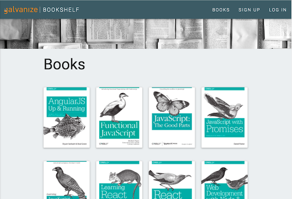

# Grant & Dave's - Galvanize Bookshelf

Bookshelf is an app designed to allow users to view a collection of books.  It can be accessed  [here](https://grant-dave-galvanize-bookshelf.herokuapp.com/).

Upon visiting the site, the user is presented with a full list of all available titles.  It is not necessary to log into the site to view the full list.  The user is also able to view details of individual titles without needing to be logged in.

To log into Bookshelf, a user must first create an account by visiting the "Sign up" link in the navbar.  Once an account is established, a user is allowed to log in using the "log in" link.  Being logged in allows a user to add any books from the collection to the user's personalized "Favorites" section which is also accessible from the link in the navbar.  

To terminate his or her session, a user may then select "Log out" from the navbar.